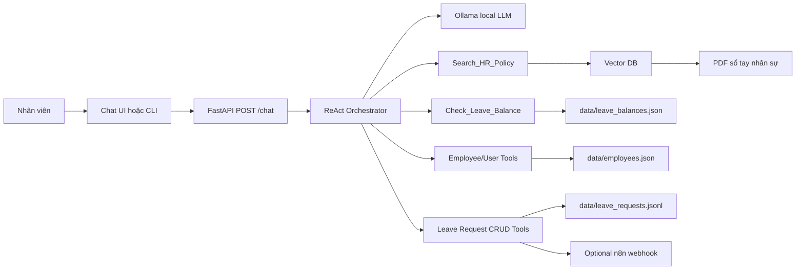

# Kiến trúc hệ thống

## 1. Tổng quan

Ứng dụng gồm một backend FastAPI điều phối ReAct Agent. LLM chạy local qua
Ollama. Tools được backend expose như các hàm Python nội bộ hoặc REST endpoints.
RAG dùng vector database nhỏ để tra cứu PDF sổ tay nhân sự. CRUD service quản lý
vòng đời yêu cầu xin nghỉ. User management service quản lý hồ sơ nhân viên,
role, trạng thái tài khoản và ngày phép.



## 2. Thành phần

### FastAPI backend

Trách nhiệm:

- Nhận request chat từ UI hoặc CLI.
- Quản lý session ngắn hạn.
- Chạy ReAct loop.
- Validate tool arguments bằng Pydantic.
- Ghi structured log cho mỗi bước.
- Expose endpoint ingest RAG cho giảng viên hoặc nhóm demo.
- Expose CRUD endpoints để test từng tool độc lập.
- Expose user management endpoints để HR admin quản lý nhân viên.

### Ollama local model

Trách nhiệm:

- Sinh `Thought` và tool call theo prompt.
- Tổng hợp `Final Answer` bằng tiếng Việt.
- Không tự bịa kết quả tool; mọi thông tin chính sách, ngày phép và trạng thái
  đơn phải dựa trên observation.

Khuyến nghị chọn model có khả năng instruction following và JSON tốt. Nếu model
không ổn định với native tool calling, backend vẫn có thể dùng ReAct text format
kèm parser riêng.

### ReAct orchestrator

Trách nhiệm:

1. Tạo system prompt gồm vai trò, rules và tool specs.
2. Gửi prompt hiện tại sang Ollama.
3. Parse output thành `Thought`, `Action`, `Final Answer`.
4. Nếu có `Action`, validate và gọi tool.
5. Đưa `Observation` vào context của bước tiếp theo.
6. Dừng khi có `Final Answer`, cần hỏi xác nhận hoặc vượt `max_steps`.

### Tool layer

Tools là các hàm có contract rõ ràng:

- `Search_HR_Policy(query, top_k)`
- `Check_Leave_Balance(employee_id)`
- `Create_Employee(full_name, email, role, department, position, manager_id)`
- `Get_Employee(employee_id)`
- `Search_Employees(query, department, role, status)`
- `Update_Employee(employee_id, patch)`
- `Deactivate_Employee(employee_id, reason)`
- `Activate_Employee(employee_id, reason)`
- `Update_Leave_Balance(employee_id, annual_leave_remaining, sick_leave_remaining)`
- `Create_Leave_Request(employee_id, type, start_date, end_date, reason)`
- `Get_Leave_Request(request_id)`
- `List_Leave_Requests(employee_id, status)`
- `Update_Leave_Request(request_id, patch)`
- `Cancel_Leave_Request(request_id, reason)`

Tool layer không để LLM ghi trực tiếp vào file. Agent chỉ được gọi tool theo
schema, backend chịu trách nhiệm validate input, kiểm tra quyền và ghi log.

### RAG layer

RAG layer có hai mode:

- Ingest: đọc PDF, chia chunk, tạo embedding, lưu vào vector DB.
- Query: embedding query, search top-k chunks, trả về nội dung và source.

### CRUD service

CRUD service quản lý yêu cầu xin nghỉ trong mock store. Trong bản lab, store có
thể là `leave_requests.jsonl`. Khi triển khai thật, service này có thể đổi sang
database mà không làm thay đổi tool contract của agent.

### User management service

User management service quản lý hồ sơ nhân viên, role, trạng thái tài khoản,
quan hệ manager và số ngày phép. Trong bản lab có thể dùng `employees.json`.
Service này là nguồn dữ liệu cho `Check_Leave_Balance` và các tool HR admin.

## 3. Đề xuất cấu trúc thư mục

```text
src/
  backend/
    main.py
    schemas.py
    settings.py
  agent/
    agent.py
    prompts.py
    tool_parser.py
  tools/
    hr_policy.py
    leave_balance.py
    user_management.py
    leave_request_crud.py
  rag/
    ingest.py
    retriever.py
    chunking.py
  data/
    hr_policy/
      company_handbook.pdf
    leave_balances.json
    employees.json
    leave_requests.jsonl
    vector_store/
logs/
docs/
```

Repo hiện tại đã có `src/agent`, `src/core` và `src/telemetry`. Nhóm có thể thêm
các module mới theo cấu trúc trên mà không cần viết lại provider pattern hiện có.

## 4. Runtime flow

1. Client gửi `POST /chat` với `session_id`, `employee_id`, `message`.
2. FastAPI nạp session memory và tạo prompt cho agent.
3. Agent hỏi Ollama để lấy bước tiếp theo.
4. Nếu model trả `Action`, backend parse và gọi tool tương ứng.
5. Tool trả observation đã được format ngắn gọn.
6. Observation được đưa lại vào loop.
7. Khi agent cần xác nhận thao tác ghi, API trả message hỏi xác nhận và lưu
   pending action vào session.
8. Khi user xác nhận, agent gọi CRUD hoặc user-management tool tương ứng.
9. API trả final answer kèm mã đơn và trạng thái mới.

## 5. Lựa chọn deploy endpoint giả lập

Bản lab ưu tiên chạy local bằng FastAPI để sinh viên debug được toàn bộ trace.
Nếu muốn demo ấn tượng hơn, có thể tách một phần mock API ra serverless:

| Cách deploy | Phù hợp cho | Ghi chú |
| --- | --- | --- |
| FastAPI local | ReAct loop, RAG, logging, debug | Cách chính cho lab. |
| Vercel Python Function | Mock user/balance/CRUD endpoint nhỏ | Dùng demo API public tạm thời. |
| Cloudflare Workers | Webhook/mock action đơn giản | Phù hợp endpoint JSON nhẹ. |
| n8n webhook | Gửi email/thông báo cho manager | Optional, không thay thế ticket store. |

Ngay cả khi deploy mock endpoint ra ngoài, tool adapter trong backend vẫn phải
giữ contract cũ. Agent không nên biết endpoint thật nằm ở đâu; agent chỉ gọi
tool theo schema.

## 6. Biến môi trường đề xuất

```env
APP_ENV=local
OLLAMA_BASE_URL=http://localhost:11434
OLLAMA_CHAT_MODEL=qwen2.5:7b-instruct
OLLAMA_EMBED_MODEL=nomic-embed-text
VECTOR_DB_PATH=./src/data/vector_store
LEAVE_BALANCE_PATH=./src/data/leave_balances.json
EMPLOYEE_DATA_PATH=./src/data/employees.json
LEAVE_REQUEST_LOG_PATH=./src/data/leave_requests.jsonl
N8N_WEBHOOK_URL=
MAX_AGENT_STEPS=6
```

Không commit file `.env` thật. Chỉ commit `.env.example` nếu cần chia sẻ default.

## 7. Guardrails

- Không gọi tool create, update hoặc cancel nếu chưa có user confirmation.
- Không tạo/sửa/khóa nhân viên nếu role hiện tại không phải `hr_admin`.
- Không tạo đơn nếu ngày kết thúc trước ngày bắt đầu.
- Không tạo đơn nếu số ngày xin nghỉ vượt quá ngày phép còn lại, trừ khi policy
  cho phép nghỉ không lương và user xác nhận.
- Không update đơn đã `approved`, `rejected` hoặc `cancelled`.
- Không hard delete đơn; thao tác "delete" trong agent phải map sang cancel.
- Nếu RAG không tìm thấy chính sách liên quan, agent phải nói không tìm thấy căn
  cứ thay vì tự suy đoán.
- Mỗi tool call cần có timeout và lỗi rõ ràng.
